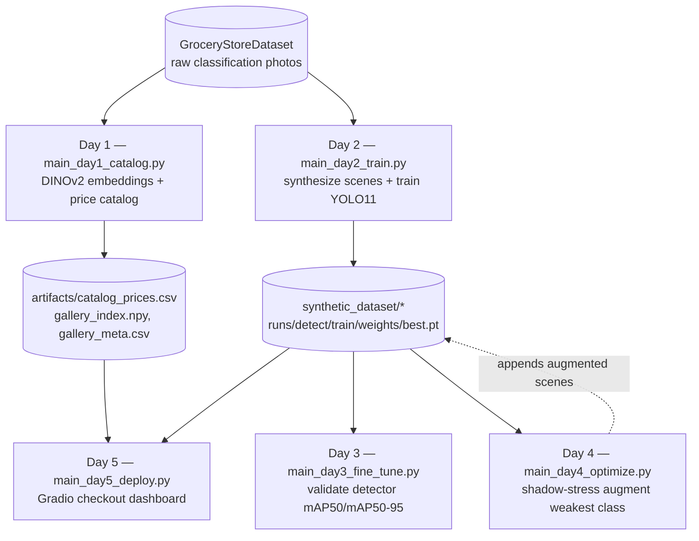
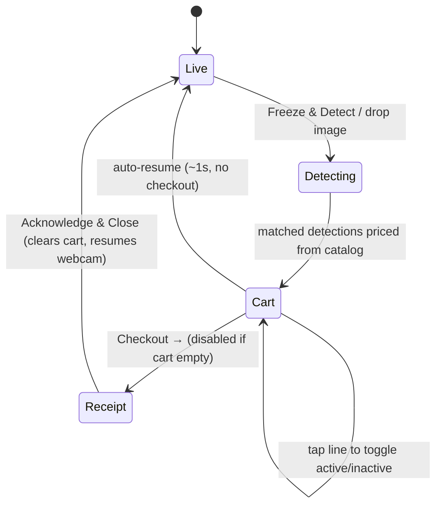
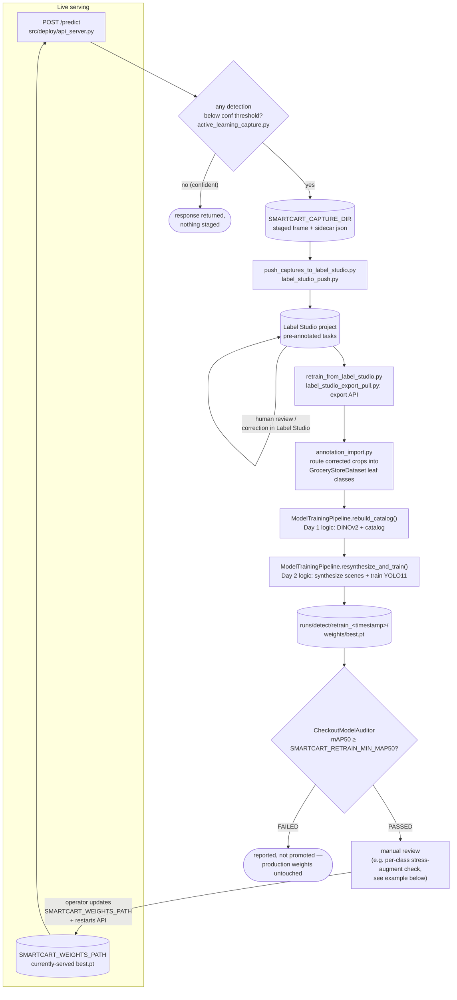
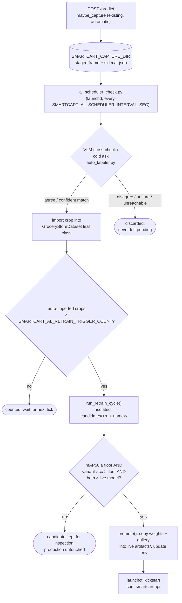

# 🛒 SmartCart AI Checkout Assistant

An autonomous retail checkout system utilizing **Programmatic Scene Synthesis** to transform unannotated classification imagery into a robust object detection and billing pipeline.

## 🎓 About This Project

Built for the Week 4 Computer Vision mini-project — see the [project briefing deck](docs/day1_project_briefing.html) for the full course framing. The brief poses it as a 5-day team story (data engineer → detection engineer → model evaluator → improvement scientist → deployment engineer), each day leaving an artifact the next needs. The product goal: given a grocery or counter photo, answer **what is here, how confident are we, and what is the estimated bill?**

This is a proof-of-concept, not barcode-level SKU recognition — matches are by visual product class, not individual SKU, and catalog prices are editable demo data rather than a live pricing feed.

## 🚀 Quick Start
1. **Initialize Project:** Run `python boostrap_project.py` to generate the directory structure (also (re)writes the standalone `scripts/` copies — see Architecture below).
2. **Install Dependencies:**
   `pip install -r requirements.txt` (or `uv sync`)
3. **Clone the dataset:** clone [Marcus Klasson's GroceryStoreDataset](https://github.com/marcusklasson/GroceryStoreDataset) into `dataset/GroceryStoreDataset`.
4. **Run Pipeline:**
   Execute the day scripts in sequence from the root:
   ```bash
   python main_day1_catalog.py
   python main_day2_train.py
   python main_day3_fine_tune.py
   python main_day4_optimize.py
   python main_day5_deploy.py
   ```

## 🗺️ Five-Day Pipeline

Mapping the brief's roles onto the actual scripts: **Day 1** (data engineer) builds product memory; **Day 2** (detection engineer) trains the detector on synthetic scenes; **Day 3** (model evaluator) validates the detector's mAP; **Day 4** (improvement scientist) augments the weakest class; **Day 5** (deployment engineer) ships the demo.



Day 4 doesn't produce a separate artifact; it appends augmented images/labels directly back into `synthetic_dataset/train`, targeting one hardcoded weak class at a time (see the "Known limitation" note below).

## 🖥️ Running the Checkout App (FastAPI + React)

Besides the Gradio dashboard produced by Day 5 of the pipeline above, the repo also has a standalone FastAPI detection backend (`main_api_server.py`) paired with a React/Vite frontend (`frontend/`). Both are configured via `.env` files instead of hardcoded values.

1. **Configure the backend:**
   ```bash
   cp .env.example .env
   ```
   Adjust `SMARTCART_HOST`/`SMARTCART_PORT`/`SMARTCART_RELOAD`/`SMARTCART_CORS_ORIGINS`/`SMARTCART_WEIGHTS_PATH`/`SMARTCART_CATALOG_PATH` as needed — see the comments in `.env.example` for what each does and its default.
2. **Run the API server:**
   ```bash
   uv run python main_api_server.py
   ```
   Serves `GET /catalog`, `POST /predict`, and `GET /health` on `http://localhost:8000` by default.
3. **Configure the frontend:**
   ```bash
   cd frontend
   cp .env.example .env
   ```
   Adjust `VITE_API_BASE_URL` (must match the backend's host/port) and `VITE_DEV_SERVER_PORT` (must match the backend's `SMARTCART_CORS_ORIGINS`, since it's a CORS allowlist) as needed.
4. **Run the frontend dev server:**
   ```bash
   npm install
   npm run dev
   ```
   Opens on `http://localhost:5173` by default.

Both `.env` files are gitignored — only the `.env.example` templates are committed.

The header's status badge (`HeaderBar.tsx`) polls `GET /health` every 5s (`frontend/src/hooks/useBackendHealth.ts`) and switches between green "Model Ready" and red "Disconnected" based on whether the backend responds — no manual refresh needed to notice the API server going down or coming back up.

### 🧾 Checkout & Receipt Flow

The cart lives entirely in the frontend's Zustand store (`frontend/src/hooks/useSmartCart.ts`) and drives the following state machine — the backend is only ever asked for detections (`POST /predict`) and prices (`GET /catalog`), never for cart totals or receipts:

1. **Live** — `CameraFeed` shows the raw webcam feed (or accepts a dropped image) via `react-webcam`.
2. **Detecting** — clicking **Freeze & Detect** posts the frozen frame to `/predict`; each detection whose label matches a catalog SKU becomes a priced line item.
3. **Cart** — `CartSidebar`/`ProductCard` list the accumulated line items with a running total; tapping a line toggles it in/out of the total. If the user doesn't check out, the feed auto-resumes to **Live** ~1s after detection.
4. **Checkout → Receipt** — the **Checkout →** button (disabled while the cart is empty) freezes the currently-active lines into a read-only `ReceiptView`; **Freeze & Detect**, **Reset**, and drag-drop are all disabled while the receipt is open so the transaction can't be mutated mid-review.
5. **Acknowledge & Close** — clears the cart, detections, and frozen frame, and returns to **Live** so the next customer's items can be scanned.



## 🎯 Active Learning with Label Studio

The FastAPI backend also exposes a Label Studio ML Backend under `/ls`, plus an uncertainty-based capture pipeline, so production checkout traffic can feed back into future retraining:

- **Env vars** (see `.env.example` for defaults): `LABEL_STUDIO_URL`, `LABEL_STUDIO_API_KEY`, `SMARTCART_LS_FROM_NAME`, `SMARTCART_LS_TO_NAME`, `SMARTCART_LS_DATA_KEY`, `SMARTCART_MODEL_VERSION`, `SMARTCART_LS_PROJECT_ID`, `SMARTCART_CAPTURE_DIR`, `SMARTCART_CAPTURE_CONF_THRESHOLD`, `SMARTCART_CAPTURE_ENABLED`, `SMARTCART_STAGING_PUBLIC_URL`.
  - `LABEL_STUDIO_API_KEY`: paste whatever Label Studio's Account & Settings → "New Auth Token" dialog gives you — it's actually a refresh token, and the backend automatically exchanges it for a short-lived access token on every call. No manual token handling needed.
  - `SMARTCART_STAGING_PUBLIC_URL` must include the `/staging` suffix and match wherever the backend is actually reachable (host + the port from `SMARTCART_PORT`), e.g. `http://localhost:8888/staging` — it's not derived automatically from the other server config vars.
  - `/staging` (where Label Studio loads `$image` from) always sends wide-open CORS (`Access-Control-Allow-Origin: *`) regardless of `SMARTCART_CORS_ORIGINS`, since Label Studio's own origin won't generally match that allowlist. `/predict`/`/catalog` are unaffected and still enforce `SMARTCART_CORS_ORIGINS` normally.
- **Connect the model in Label Studio:** Settings → Machine Learning → Add Model:
  - **Name**: any descriptive label, e.g. "SmartCart YOLO"
  - **Backend URL**: `http://<host>:8000/ls`
  - **Authentication method**: "No Authentication"
  - **Any extra params**: leave empty — the backend reads all configuration from its own `.env`, not from per-connection params
  - Click "Validate and Save" (calls `GET /ls/health` + `POST /ls/setup`), then enable "Retrieve predictions when loading a task automatically" to use `POST /ls/predict`.
- **Required labeling config** (Settings → Labeling Interface) — `name`/`toName` must match `SMARTCART_LS_FROM_NAME`/`SMARTCART_LS_TO_NAME`, `$image` must match `SMARTCART_LS_DATA_KEY`, and one `<Label value>` must exist for **every** class in `synthetic_dataset/data.yaml`'s `names` (now all 83 GroceryStoreDataset leaf classes, not a hand-picked subset — too many to inline here, generate the `<Label>` list from that file's `names` dict):
  ```xml
  <View>
    <Image name="image" value="$image"/>
    <RectangleLabels name="label" toName="image">
      <Label value="Fruit/Apple/Golden-Delicious" background="#e6194b"/>
      <Label value="Fruit/Apple/Royal-Gala" background="#3cb44b"/>
      <!-- ...one <Label> per entry in synthetic_dataset/data.yaml's `names` (83 total)... -->
      <Label value="Vegetables/Zucchini" background="#911eb4"/>
    </RectangleLabels>
  </View>
  ```
- **Capture → push workflow:** production `/predict` traffic automatically stages frames with no detections or any detection below `SMARTCART_CAPTURE_CONF_THRESHOLD` to `SMARTCART_CAPTURE_DIR`. Run `SMARTCART_LS_PROJECT_ID=<id> uv run python push_captures_to_label_studio.py` to import the staged frames, pre-annotated, into that Label Studio project for review.

### 🔁 Closed retrain loop

`retrain_from_label_studio.py` closes the loop end-to-end: pulls corrected annotations from the Label Studio project (`SMARTCART_LS_PROJECT_ID`) via its export API, imports them into the `GroceryStoreDataset` leaf-class tree (reusing `import_annotations.py`'s existing crop/route logic), rebuilds the Day 1 catalog, resynthesizes scenes, retrains, and gates on `CheckoutModelAuditor`'s mAP50 against `SMARTCART_RETRAIN_MIN_MAP50` (default `0.5`).

```bash
SMARTCART_LS_PROJECT_ID=<id> uv run python retrain_from_label_studio.py
```



- **Promotion is always manual.** The retrained candidate lands in a fresh `runs/detect/retrain_<timestamp>/weights/best.pt` — the currently-served `runs/detect/train/` and `SMARTCART_WEIGHTS_PATH` are never touched automatically, regardless of whether the audit passes. On a PASSED report, update `SMARTCART_WEIGHTS_PATH` in `.env` to the new path and restart the API yourself.
- **Known limitation:** `retrain_from_label_studio.py`'s loop never calls the Day 4 stress augmentor — it's a separate, manual step (see the example below). `main_day4_optimize.py` itself is still hardcoded to target `Snacks/Chocolate-Bar`, which is no longer reliably the weakest class after new Label Studio imports change the class distribution; identifying the *current* weakest class means reading each retrain's own per-class audit output and passing that class's id to `EnvironmentalStressAugmentor.optimize_target_classes()` by hand.

### 📈 Example: fixing over-fragmented active-learning classes (2026-07-09)

A prior retrain (`retrain_20260709_163218`, folding in real production captures via `retrain_from_label_studio.py`) scored an overall mAP50 of only 0.7870 — a regression from earlier 0.95+ runs. Root cause: `annotation_import.py`'s label routing had let two categories fragment past this project's stated visual-product-class scope (see "About This Project" above) into per-SKU classes — `Ready-To-Eat/Instant-Noodles` split into 21 brand/flavor classes and `Snacks/Chocolate-Bar` into 18, each backed by only 2-4 real photos from active-learning captures. Neither category exists in the original GroceryStoreDataset at all; both were fabricated wholesale by the import at whatever granularity the annotator labeled with, and that granularity was far too fine to be learnable from so few examples per class — no amount of additional per-SKU data collection would fix it without contradicting the project's own scope.

The fix: flatten both categories' brand/flavor subfolders back into a single coarse leaf class each directly in `dataset/GroceryStoreDataset`, then rerun the same isolated retrain (`ModelTrainingPipeline`, minus the Label Studio pull step):

| | Before (`retrain_20260709_163218`) | After (`retrain_20260709_202721`) |
|---|---|---|
| Overall mAP50 | 0.7870 | **0.9542** |
| Overall mAP50-95 | 0.7661 | **0.9315** |
| `Ready-To-Eat/Instant-Noodles` mAP50 / recall | mostly zero-detection in production | **0.991 / 0.942** |
| `Snacks/Chocolate-Bar` mAP50 / recall | fragmented, weak | **0.961 / 0.836** |

Promoted: `SMARTCART_WEIGHTS_PATH` updated to `runs/detect/retrain_20260709_202721/weights/best.pt` and the API restarted.

## 🤖 Autonomous Active-Learning Pipeline

The manual loop above still works standalone, but it can also run itself: a local vision-language model stands in for the human Label Studio reviewer, and a passing retrain candidate promotes itself — no `push_captures_to_label_studio.py`, no clicking through Label Studio, no manually editing `SMARTCART_WEIGHTS_PATH`.

- **Requires a local [LM Studio](https://lmstudio.ai) instance** serving a vision-capable model (developed against `qwen2.5-vl-3b-instruct`) with its API server running.
- **Env vars** (see `.env.example`): `SMARTCART_VLM_BASE_URL` (default `http://localhost:1234`), `SMARTCART_VLM_MODEL`, `SMARTCART_AUTOLABEL_MIN_CONF` (default `0.35` — the lower bound of the "mid-confidence" band; the upper bound reuses `SMARTCART_CAPTURE_CONF_THRESHOLD`), `SMARTCART_AL_RETRAIN_TRIGGER_COUNT` (default `50` — auto-imported crops needed since the last retrain attempt), `SMARTCART_RETRAIN_MIN_VARIANT_ACC` (default `0.5` — DINOv2 variant-accuracy floor, alongside the existing `SMARTCART_RETRAIN_MIN_MAP50`), `SMARTCART_AL_AUDIT_SAMPLE_RATE` (default `0.05`), `SMARTCART_AL_STATE_PATH`.
- **How a capture gets auto-labeled instead of sent to a human:**
  - *Mid-confidence detections* (YOLO saw something, just not confidently): the crop is shown to the VLM independently. If the VLM's answer agrees with YOLO's guess, the crop is imported straight into the dataset tree. Any disagreement, "unsure" answer, or VLM-unreachable error discards the capture — two independent signals failing to agree is treated as "not confident enough," never a coin flip.
  - *Zero-detection / very-low-confidence frames*: the VLM is asked cold, over the whole frame, for a category match and (if possible) a bounding box. A parseable, plausible box is used; otherwise the whole frame is used as the crop, since this app's own capture flow is already one held-up item per frame.
  - A sampled fraction of every decision (`SMARTCART_AL_AUDIT_SAMPLE_RATE`) is logged to `artifacts/al_review/` for optional, non-blocking human spot-checking — nothing reads this directory automatically.
- **Retrain, dual-gate, promote:** once enough new crops accumulate (`SMARTCART_AL_RETRAIN_TRIGGER_COUNT`), a full retrain cycle runs against an isolated candidate directory (never touching live `artifacts/` mid-run). A candidate only promotes if it doesn't regress either metric versus the live model **and** clears both absolute floors (YOLO mAP50, DINOv2 variant accuracy). On promotion, the candidate's weights + gallery/catalog replace the live ones and the API server restarts automatically to pick them up.



**Setup:**
1. Start LM Studio with a vision-capable model loaded and its API server running.
2. Run `uv run python seed_al_baseline.py` once — measures the currently-served model's real mAP50/variant-accuracy so the first autonomous promotion compares against reality, not a zero baseline.
3. Install both launchd services per `launchd/README.md` (`com.smartcart.api` runs the API server persistently; `com.smartcart.al-scheduler` runs the checker on an interval).

The existing manual Label Studio loop (above) remains fully available — install neither launchd service to keep everything manual, or use both loops side by side (e.g. Label Studio for genuinely new products the VLM doesn't recognize, autonomous for everything already in the catalog).

## 🏗️ Project Architecture
The project is modularized into `src/` (core logic) and root-level `main_dayN_*.py` scripts (orchestration) — each day's script is a thin entrypoint that imports its logic from `src/`.

A second, self-contained copy of the same logic lives under `scripts/main_dayN_*.py`; those files embed their own classes with no `src/` dependency and are regenerated wholesale by `boostrap_project.py`. Develop against the root scripts + `src/`; treat `scripts/` as a frozen snapshot.

- **Data Engineering:** Uses synthetic composition to solve the bounding-box annotation gap.
- **Vision Backbone:** Employs frozen DINOv2 embeddings for high-fidelity product indexing.
- **Detector:** Utilizes YOLOv11 optimized for MPS/Apple Silicon.

## 🛠️ Folder Structure
- `src/data/` — dataset indexing (`gallery.py`), DINOv2 embedding gallery, scene synthesis, Label Studio annotation import (`annotation_import.py`) and export-pull (`label_studio_export_pull.py`, behind `retrain_from_label_studio.py`), VLM-based auto-labeling of staged captures (`auto_labeler.py`, behind `al_scheduler_check.py`).
- `src/models/` — YOLO evaluation (auditor), stress augmentation (optimizer), DINOv2 feature extraction, DINOv2 held-out variant-accuracy audit (`variant_auditor.py`), LM Studio VLM client (`vlm_verifier.py`).
- `src/deploy/` — `api_server.py` (FastAPI backend behind `main_api_server.py`), `detector.py` (shared YOLO detector singleton), `label_studio_backend.py` (Label Studio ML Backend routes under `/ls`), `active_learning_capture.py` (uncertainty-based frame capture), `label_studio_push.py` (pushes captures into Label Studio, behind `push_captures_to_label_studio.py`), and `register.py` (the Gradio checkout register behind `main_day5_deploy.py`).
- `src/pipeline/` — `training_pipeline.py`'s `ModelTrainingPipeline` (rebuild catalog → resynthesize → retrain → audit, behind `retrain_from_label_studio.py`; always writes to a fresh `runs/detect/retrain_<timestamp>/` + `synthetic_dataset_retrain/`, never to `runs/detect/train/` or `SMARTCART_WEIGHTS_PATH`), `candidate_promotion.py` (state/report persistence + mechanical promotion decision for the autonomous loop), `al_scheduler.py` (orchestrates the autonomous loop, behind root `al_scheduler_check.py`).
- `launchd/` — `com.smartcart.api.plist` / `com.smartcart.al-scheduler.plist` service definitions + install/verify/uninstall instructions for the autonomous pipeline.
- `frontend/` — React/Vite checkout UI that talks to the FastAPI backend. Key pieces: `hooks/useSmartCart.ts` (Zustand store for detections/cart/checkout state), `components/CameraFeed.tsx` (webcam, freeze/detect, drag-drop), `components/CartSidebar.tsx` (switches between the live cart and the receipt), `components/ReceiptView.tsx` (read-only checkout receipt), `components/ProductCard.tsx` (shared cart/receipt line row).
- `dataset/`: Raw GroceryStoreDataset source.
- `synthetic_dataset/`: Procedurally generated training/val scenes.
- `artifacts/`: Day 1 outputs (product catalog, embedding gallery); also `artifacts/candidates/` (isolated retrain candidates) and `artifacts/al_review/` (sampled auto-label audit trail) for the autonomous pipeline.
- `runs/`: Training logs and model weights.
