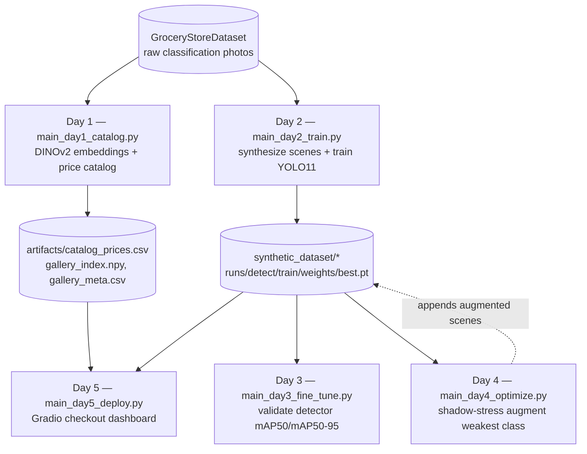
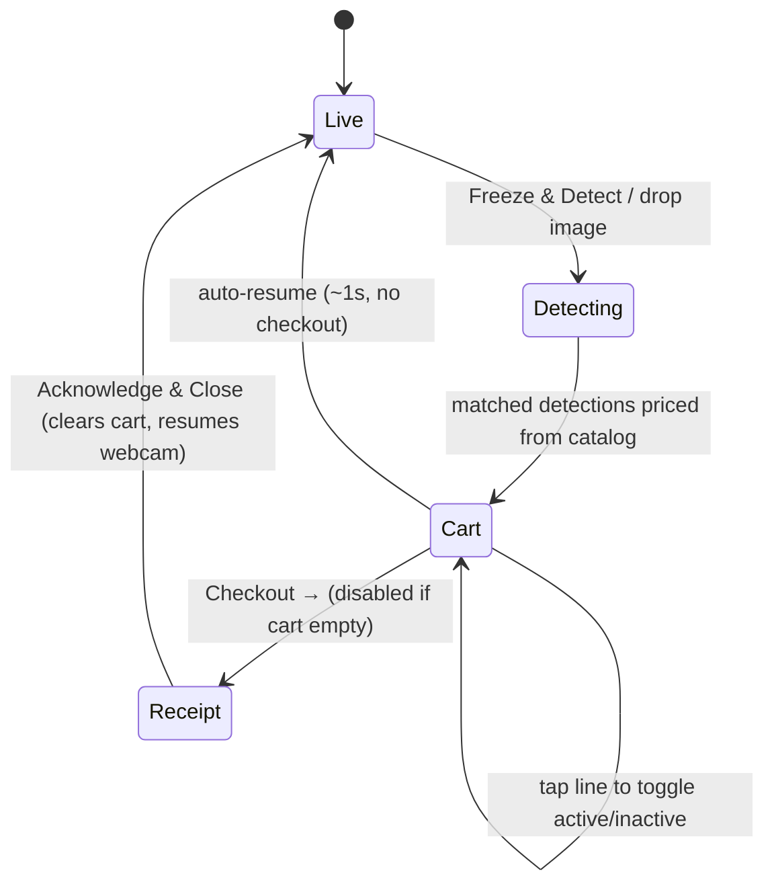
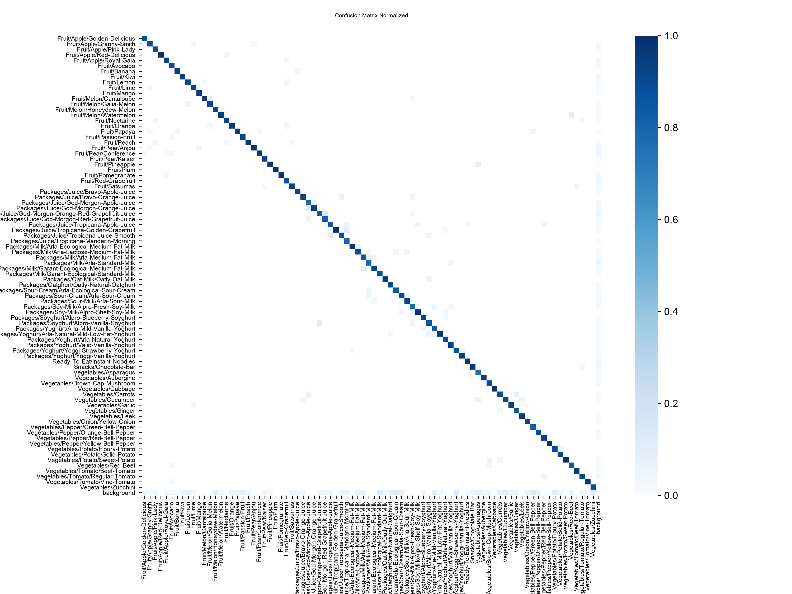
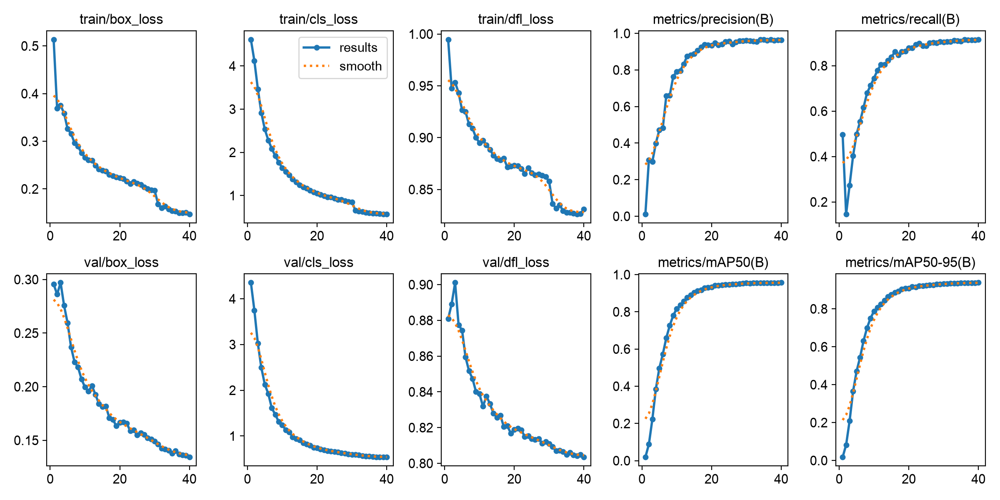
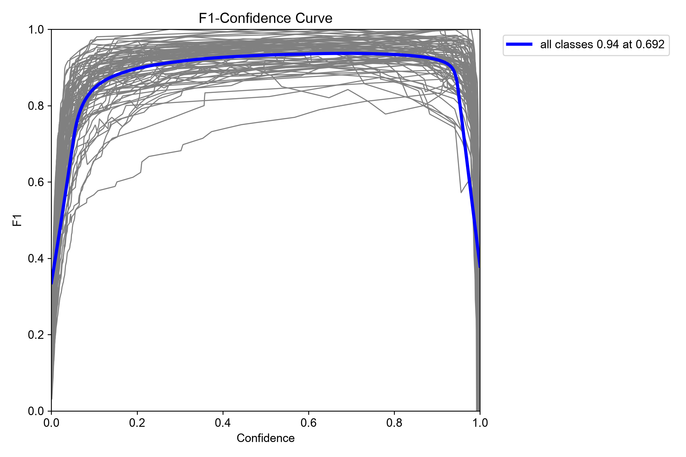
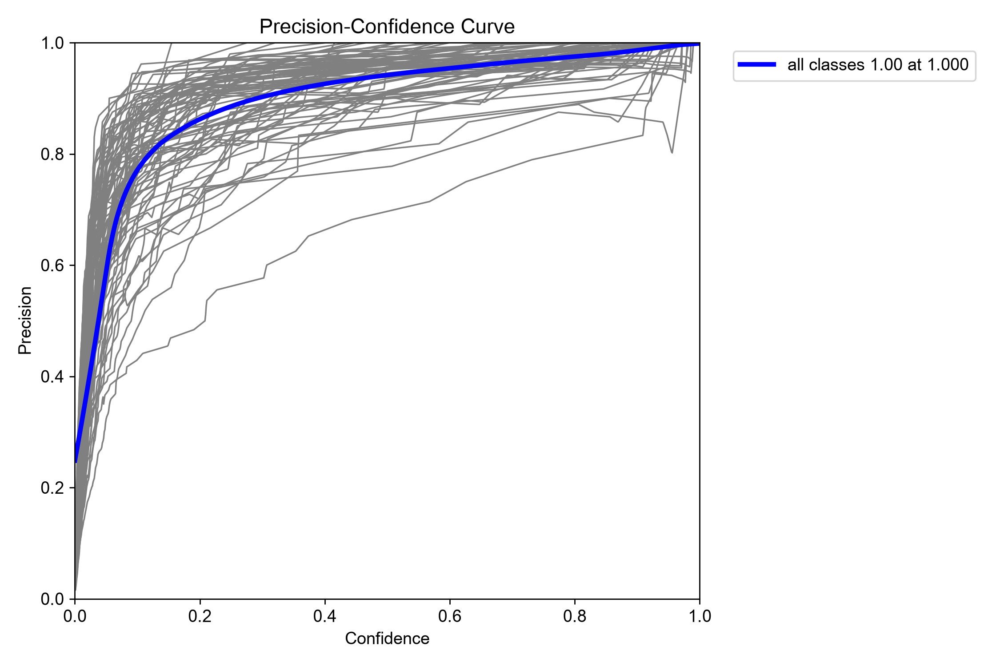

# 🛒 SmartCart AI Checkout Assistant

An autonomous retail checkout system utilizing **Programmatic Scene Synthesis** to transform unannotated classification imagery into a robust object detection and billing pipeline.

## 🎓 About This Project

Built for the Week 4 Computer Vision mini-project — see the [project briefing deck](docs/day1_project_briefing.html) for the full course framing. The brief poses it as a 5-day team story (data engineer → detection engineer → model evaluator → improvement scientist → deployment engineer), each day leaving an artifact the next needs. The product goal: given a grocery or counter photo, answer **what is here, how confident are we, and what is the estimated bill?**

This is a proof-of-concept, not barcode-level SKU recognition — matches are by visual product class, not individual SKU, and catalog prices are editable demo data rather than a live pricing feed.

## 🚀 Quick Start
1. **Initialize Project:** Run `python boostrap_project.py` to generate the directory structure (also (re)writes the standalone `scripts/` copies — see Architecture below).
2. **Install Dependencies:**
   `pip install -r requirements.txt` (or `uv sync`)
3. **Clone the dataset:** clone [Marcus Klasson's GroceryStoreDataset](https://github.com/marcusklasson/GroceryStoreDataset) into `dataset/GroceryStoreDataset`.
4. **Run Pipeline:**
   Execute the day scripts in sequence from the root:
   ```bash
   python main_day1_catalog.py
   python main_day2_train.py
   python main_day3_fine_tune.py
   python main_day4_optimize.py
   python main_day5_deploy.py
   ```

## 🗺️ Five-Day Pipeline

Mapping the brief's roles onto the actual scripts: **Day 1** (data engineer) builds product memory; **Day 2** (detection engineer) trains the detector on synthetic scenes; **Day 3** (model evaluator) validates the detector's mAP; **Day 4** (improvement scientist) augments the weakest class; **Day 5** (deployment engineer) ships the demo.



Day 4 doesn't produce a separate artifact; it appends augmented images/labels directly back into `synthetic_dataset/train`, targeting one hardcoded weak class at a time (see the "Known limitation" note below).

## 🖥️ Running the Checkout App (FastAPI + React)

Besides the Gradio dashboard produced by Day 5 of the pipeline above, the repo also has a standalone FastAPI detection backend (`main_api_server.py`) paired with a React/Vite frontend (`frontend/`). Both are configured via `.env` files instead of hardcoded values.

1. **Configure the backend:**
   ```bash
   cp .env.example .env
   ```
   Adjust `SMARTCART_HOST`/`SMARTCART_PORT`/`SMARTCART_RELOAD`/`SMARTCART_CORS_ORIGINS`/`SMARTCART_WEIGHTS_PATH`/`SMARTCART_CATALOG_PATH` as needed — see the comments in `.env.example` for what each does and its default.
2. **Run the API server:**
   ```bash
   uv run python main_api_server.py
   ```
   Serves `GET /catalog` and `POST /predict` on `http://localhost:8000` by default.
3. **Configure the frontend:**
   ```bash
   cd frontend
   cp .env.example .env
   ```
   Adjust `VITE_API_BASE_URL` (must match the backend's host/port) and `VITE_DEV_SERVER_PORT` (must match the backend's `SMARTCART_CORS_ORIGINS`, since it's a CORS allowlist) as needed.
4. **Run the frontend dev server:**
   ```bash
   npm install
   npm run dev
   ```
   Opens on `http://localhost:5173` by default.

Both `.env` files are gitignored — only the `.env.example` templates are committed.

### 🧾 Checkout & Receipt Flow

The cart lives entirely in the frontend's Zustand store (`frontend/src/hooks/useSmartCart.ts`) and drives the following state machine — the backend is only ever asked for detections (`POST /predict`) and prices (`GET /catalog`), never for cart totals or receipts:

1. **Live** — `CameraFeed` shows the raw webcam feed (or accepts a dropped image) via `react-webcam`.
2. **Detecting** — clicking **Freeze & Detect** posts the frozen frame to `/predict`; each detection whose label matches a catalog SKU becomes a priced line item.
3. **Cart** — `CartSidebar`/`ProductCard` list the accumulated line items with a running total; tapping a line toggles it in/out of the total. If the user doesn't check out, the feed auto-resumes to **Live** ~1s after detection.
4. **Checkout → Receipt** — the **Checkout →** button (disabled while the cart is empty) freezes the currently-active lines into a read-only `ReceiptView`; **Freeze & Detect**, **Reset**, and drag-drop are all disabled while the receipt is open so the transaction can't be mutated mid-review.
5. **Acknowledge & Close** — clears the cart, detections, and frozen frame, and returns to **Live** so the next customer's items can be scanned.



## 🎯 Active Learning with Label Studio

The FastAPI backend also exposes a Label Studio ML Backend under `/ls`, plus an uncertainty-based capture pipeline, so production checkout traffic can feed back into future retraining:

- **Env vars** (see `.env.example` for defaults): `LABEL_STUDIO_URL`, `LABEL_STUDIO_API_KEY`, `SMARTCART_LS_FROM_NAME`, `SMARTCART_LS_TO_NAME`, `SMARTCART_LS_DATA_KEY`, `SMARTCART_MODEL_VERSION`, `SMARTCART_LS_PROJECT_ID`, `SMARTCART_CAPTURE_DIR`, `SMARTCART_CAPTURE_CONF_THRESHOLD`, `SMARTCART_CAPTURE_ENABLED`, `SMARTCART_STAGING_PUBLIC_URL`.
- **Connect the model in Label Studio:** Settings → Machine Learning → Add Model:
  - **Name**: any descriptive label, e.g. "SmartCart YOLO"
  - **Backend URL**: `http://<host>:8000/ls`
  - **Authentication method**: "No Authentication"
  - **Any extra params**: leave empty — the backend reads all configuration from its own `.env`, not from per-connection params
  - Click "Validate and Save" (calls `GET /ls/health` + `POST /ls/setup`), then enable "Retrieve predictions when loading a task automatically" to use `POST /ls/predict`.
- **Required labeling config** (Settings → Labeling Interface) — `name`/`toName` must match `SMARTCART_LS_FROM_NAME`/`SMARTCART_LS_TO_NAME`, `$image` must match `SMARTCART_LS_DATA_KEY`, and one `<Label value>` must exist for **every** class in `synthetic_dataset/data.yaml`'s `names` (now all 83 GroceryStoreDataset leaf classes, not a hand-picked subset — too many to inline here, generate the `<Label>` list from that file's `names` dict):
  ```xml
  <View>
    <Image name="image" value="$image"/>
    <RectangleLabels name="label" toName="image">
      <Label value="Fruit/Apple/Golden-Delicious" background="#e6194b"/>
      <Label value="Fruit/Apple/Royal-Gala" background="#3cb44b"/>
      <!-- ...one <Label> per entry in synthetic_dataset/data.yaml's `names` (83 total)... -->
      <Label value="Vegetables/Zucchini" background="#911eb4"/>
    </RectangleLabels>
  </View>
  ```
- **Capture → push workflow:** production `/predict` traffic automatically stages frames with no detections or any detection below `SMARTCART_CAPTURE_CONF_THRESHOLD` to `SMARTCART_CAPTURE_DIR`. Run `SMARTCART_LS_PROJECT_ID=<id> uv run python push_captures_to_label_studio.py` to import the staged frames, pre-annotated, into that Label Studio project for review.

### 🔁 Closed retrain loop

`retrain_from_label_studio.py` closes the loop end-to-end: pulls corrected annotations from the Label Studio project (`SMARTCART_LS_PROJECT_ID`) via its export API, imports them into the `GroceryStoreDataset` leaf-class tree (reusing `import_annotations.py`'s existing crop/route logic), rebuilds the Day 1 catalog, resynthesizes scenes, retrains, and gates on `CheckoutModelAuditor`'s mAP50 against `SMARTCART_RETRAIN_MIN_MAP50` (default `0.5`).

```bash
SMARTCART_LS_PROJECT_ID=<id> uv run python retrain_from_label_studio.py
```

- **Promotion is always manual.** The retrained candidate lands in a fresh `runs/detect/retrain_<timestamp>/weights/best.pt` — the currently-served `runs/detect/train/` and `SMARTCART_WEIGHTS_PATH` are never touched automatically, regardless of whether the audit passes. On a PASSED report, update `SMARTCART_WEIGHTS_PATH` in `.env` to the new path and restart the API yourself.
- **Known limitation:** `retrain_from_label_studio.py`'s loop never calls the Day 4 stress augmentor — it's a separate, manual step (see the example below). `main_day4_optimize.py` itself is still hardcoded to target `Snacks/Chocolate-Bar`, which is no longer reliably the weakest class after new Label Studio imports change the class distribution; identifying the *current* weakest class means reading each retrain's own per-class audit output and passing that class's id to `EnvironmentalStressAugmentor.optimize_target_classes()` by hand.

### 📈 Example: retrain + weak-class stress augmentation (2026-07-08)

After importing new Label Studio annotations for `Ready-To-Eat/Instant-Noodles` and `Snacks/Chocolate-Bar`, a safe isolated retrain was run directly via `ModelTrainingPipeline` (the same orchestration `retrain_from_label_studio.py` uses, minus the Label Studio pull step) against the full 83-class catalog, then the resulting per-class audit was used to target one more round of shadow-stress augmentation at whichever class actually scored weakest:

| | Baseline retrain (`retrain_20260708_184220`) | + shadow-stress augmentation (`retrain_20260708_184220_stress`) |
|---|---|---|
| Overall mAP50 | 0.9568 | 0.9572 |
| Overall mAP50-95 | 0.9382 | 0.9376 |
| Weakest class: `Packages/Soy-Milk/Alpro-Fresh-Soy-Milk` mAP50 | 0.853 | 0.892 |
| Weakest class recall | 0.784 | 0.864 |

The weak class here was **not** `Snacks/Chocolate-Bar` — that class scored 0.966 mAP50 in the baseline retrain, since the Label Studio import had already raised its image count well past "weakest." The actual weakest class was found by reading the baseline retrain's own audit table, then pointing `EnvironmentalStressAugmentor.optimize_target_classes()` at that class's id directly against `synthetic_dataset_retrain/retrain_20260708_184220/train/{images,labels}`, followed by a second training pass (same `data.yaml`, fresh `yolo11n.pt`) into its own isolated run.

Overall metrics held steady and the targeted class improved, but several unrelated classes shifted by a comparable magnitude in both directions — with only one training run per candidate, this is a directionally positive single data point, not strong evidence of a reliable causal effect. **`retrain_20260708_184220` (the baseline, pre-stress-augmentation candidate) is the one actually promoted to `SMARTCART_WEIGHTS_PATH`** — the stress-augmented run's mixed per-class effects weren't judged worth it over the simpler baseline lineage.

Ultralytics' own end-of-training validation plots for the promoted run (`runs/detect/retrain_20260708_184220/`, gitignored — copied here for reference):

<table>
<tr>
<td></td>
<td></td>
</tr>
<tr>
<td></td>
<td></td>
</tr>
</table>

The confusion matrix's diagonal dominance (near-white off-diagonal at this scale) reflects the 0.957 aggregate mAP50 — visible off-diagonal mass clusters within coarse categories (e.g. juice variants, yoghurt variants) rather than across them, consistent with the earlier Day 3 review's expectation for this fine-grained catalog. The same plot set exists for the non-promoted stress-augmented run under `runs/detect/retrain_20260708_184220_stress/` locally (not committed, since only one candidate's plots are kept in the repo) for anyone who wants to compare directly.

## 🏗️ Project Architecture
The project is modularized into `src/` (core logic) and root-level `main_dayN_*.py` scripts (orchestration) — each day's script is a thin entrypoint that imports its logic from `src/`.

A second, self-contained copy of the same logic lives under `scripts/main_dayN_*.py`; those files embed their own classes with no `src/` dependency and are regenerated wholesale by `boostrap_project.py`. Develop against the root scripts + `src/`; treat `scripts/` as a frozen snapshot.

- **Data Engineering:** Uses synthetic composition to solve the bounding-box annotation gap.
- **Vision Backbone:** Employs frozen DINOv2 embeddings for high-fidelity product indexing.
- **Detector:** Utilizes YOLOv11 optimized for MPS/Apple Silicon.

## 🛠️ Folder Structure
- `src/data/` — dataset indexing (`gallery.py`), DINOv2 embedding gallery, scene synthesis, Label Studio annotation import (`annotation_import.py`) and export-pull (`label_studio_export_pull.py`, behind `retrain_from_label_studio.py`).
- `src/models/` — YOLO evaluation (auditor), stress augmentation (optimizer), DINOv2 feature extraction.
- `src/deploy/` — `api_server.py` (FastAPI backend behind `main_api_server.py`), `detector.py` (shared YOLO detector singleton), `label_studio_backend.py` (Label Studio ML Backend routes under `/ls`), `active_learning_capture.py` (uncertainty-based frame capture), `label_studio_push.py` (pushes captures into Label Studio, behind `push_captures_to_label_studio.py`), and `register.py` (the Gradio checkout register behind `main_day5_deploy.py`).
- `src/pipeline/` — `training_pipeline.py`'s `ModelTrainingPipeline` (rebuild catalog → resynthesize → retrain → audit, behind `retrain_from_label_studio.py`; always writes to a fresh `runs/detect/retrain_<timestamp>/` + `synthetic_dataset_retrain/`, never to `runs/detect/train/` or `SMARTCART_WEIGHTS_PATH`).
- `frontend/` — React/Vite checkout UI that talks to the FastAPI backend. Key pieces: `hooks/useSmartCart.ts` (Zustand store for detections/cart/checkout state), `components/CameraFeed.tsx` (webcam, freeze/detect, drag-drop), `components/CartSidebar.tsx` (switches between the live cart and the receipt), `components/ReceiptView.tsx` (read-only checkout receipt), `components/ProductCard.tsx` (shared cart/receipt line row).
- `dataset/`: Raw GroceryStoreDataset source.
- `synthetic_dataset/`: Procedurally generated training/val scenes.
- `artifacts/`: Day 1 outputs (product catalog, embedding gallery).
- `runs/`: Training logs and model weights.
