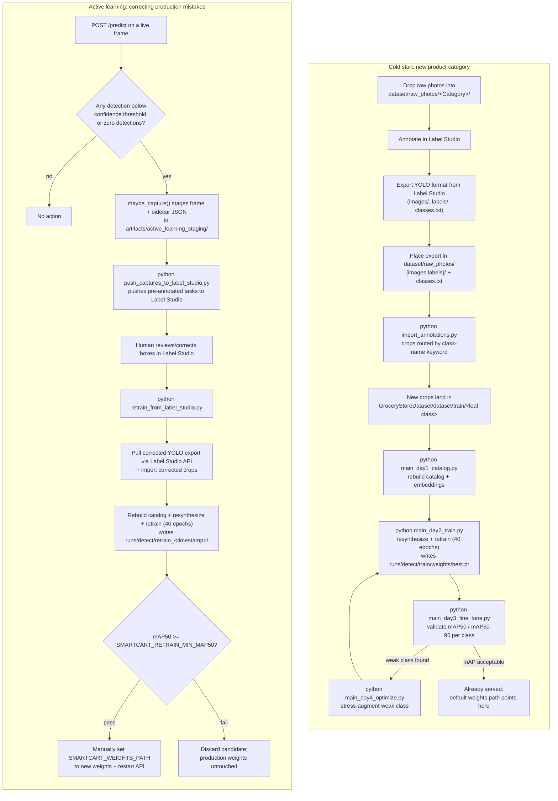

# Raw photo staging + Label Studio annotation

This directory holds product photos *before* they're cropped and merged into
`dataset/GroceryStoreDataset/dataset/train/`. It is intentionally outside the
`GroceryStoreDataset/` folder, which is its own git repo.

There are two distinct paths into the detector, both ending in a retrain:

- **Cold start** (this directory) — bootstrapping a brand-new product category
  from scratch: raw photos → Label Studio → import → full Day 1-3 pipeline.
- **Active learning** (production loop) — the live detector flags frames it's
  unsure about, those get annotated/corrected, and a separate retrain script
  folds the corrections back in without touching what's currently served.

Both are diagrammed at the bottom of this file.

## 1. Drop in raw photos

- `dataset/raw_photos/Instant-Noodles/` — one photo per instant-noodle item,
  single product per photo, any background.
- `dataset/raw_photos/Chocolate-Bar/` — one photo per chocolate-bar item, same rule.

## 2. Annotate in Label Studio

1. Install/run Label Studio (`pip install label-studio && label-studio start`,
   or your existing instance).
2. Create a single project covering photos from all `dataset/raw_photos/<Category>/`
   folders (a combined export is what the import script now expects — see Task 3).
3. Import the photos from every `dataset/raw_photos/<Category>/` folder into that
   one project.
4. Labeling config: rectangle labels drawn tightly around each product, named
   with the item's full leaf-class path (e.g.
   `Ready-To-Eat/Instant-Noodles/Maggi/2-Minute-Curry`,
   `Snacks/Chocolate-Bar/Cadbury/Dairy-Milk`). Multiple boxes per photo are
   supported — the import script crops every box in every label file.
5. Export the finished annotations using Label Studio's **YOLO** export
   format. This produces an `images/` folder, a `labels/` folder (one `.txt`
   per image, one line per box as `class_id cx cy w h` normalized), and a
   `classes.txt` (class names indexed by line number).
6. Unzip/place the export directly here, merging into
   `dataset/raw_photos/{images,labels}/` and `dataset/raw_photos/classes.txt`
   (`images/` is gitignored — it's working-tree only, not committed).

## 3. Import

Run `python import_annotations.py` (see repo root) to crop every bounding box
in the combined export and route each crop into the destination directory
whose keyword matches the box's class name (substring match, e.g.
`"Instant-Noodles"` → `dataset/GroceryStoreDataset/dataset/train/Ready-To-Eat/Instant-Noodles/`,
`"Chocolate"` → `dataset/GroceryStoreDataset/dataset/train/Snacks/Chocolate-Bar/`).
Boxes whose class name doesn't match any configured keyword are skipped.
Add a new category by adding its raw-photo folder here and a new
`{keyword: dest_dir}` entry in `import_annotations.py`.

## 4. Retrain on the imported category

The class map every pipeline stage uses (`GroceryDatasetIndexer.build_class_map()`)
is built by walking `dataset/GroceryStoreDataset/dataset/train/` at run time, so
the new crops from Task 3 are picked up automatically — no manual class-map
edits needed. Rerun the pipeline in order:

```bash
python main_day1_catalog.py   # rebuild catalog + DINOv2 embedding gallery
python main_day2_train.py     # resynthesize checkout scenes + retrain YOLO11 (40 epochs)
python main_day3_fine_tune.py # validate mAP50 / mAP50-95, check per-class weak spots
python main_day4_optimize.py  # optional: stress-augment a weak class, then rerun Day 2
```

Day 2 trains straight into `runs/detect/train/weights/best.pt` — the path the
FastAPI backend and Gradio dashboard already serve by default (or via
`SMARTCART_WEIGHTS_PATH`), so no separate promotion step is needed here; just
restart whichever server is running so it picks up the new weights file.

## 5. Active learning: correcting production mistakes

Separately from the cold-start flow above, the live checkout API stages frames
it's unsure about for review, without touching what it's currently serving:

1. Every `POST /predict` call runs `maybe_capture()`
   (`src/deploy/active_learning_capture.py`). If any detection scores below
   `SMARTCART_CAPTURE_CONF_THRESHOLD` (default 0.5) — or there are zero
   detections — the frame and its sidecar JSON (detections, confidences,
   timestamp) are written to `artifacts/active_learning_staging/`.
2. `python push_captures_to_label_studio.py` pushes each staged capture into a
   Label Studio project (`SMARTCART_LS_PROJECT_ID`) as a task pre-annotated
   with the model's own (weak) predictions, then moves pushed captures into
   `artifacts/active_learning_staging/pushed/`.
3. A human reviews/corrects the pre-annotated boxes in Label Studio — this is
   the same manual annotation step as Task 2 above, just scoped to frames the
   model was already uncertain about instead of a fresh photo batch.
4. `python retrain_from_label_studio.py` pulls the corrected export back via
   the Label Studio API, imports the corrected crops, then rebuilds the
   catalog, resynthesizes scenes, and retrains — but into a fresh
   `runs/detect/retrain_<timestamp>/`, never into `runs/detect/train/`.
5. The script audits the candidate's mAP50 against
   `SMARTCART_RETRAIN_MIN_MAP50` (default 0.5) and reports PASSED/FAILED.
   Promotion is manual and deliberate: only on PASSED do you set
   `SMARTCART_WEIGHTS_PATH` to the new weights path and restart the API.
   Production weights are never touched automatically.

## End-to-end process


